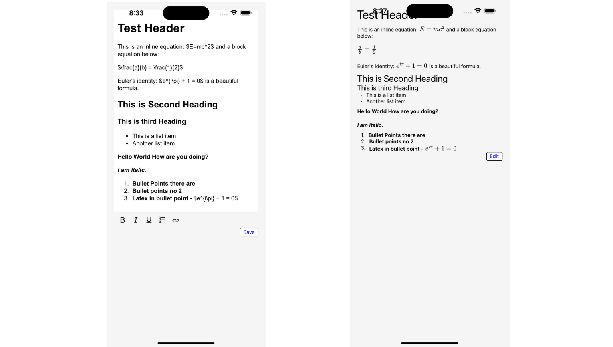

# React Native Markdown Editor with LaTeX Support

A professional-grade React Native component for editing and rendering Markdown with full LaTeX support, designed for educational, scientific, and technical documentation applications.

## Features

- **Markdown Editing & Rendering**: Switch between rich text editing and Markdown viewing seamlessly.
- **LaTeX Support**: Render inline and block LaTeX equations with high fidelity.
- **Customization Options**: Tailor the editor's behavior and appearance with custom styles and plugins.
- **Read-Only Mode**: Disable editing to use the component as a viewer for Markdown and LaTeX content.
- **HTML to Markdown Conversion**: Automatically convert HTML to Markdown when switching between editor and viewer.
- **Customizable Toolbar**: Easily configure the toolbar with your desired actions and styles.


## Screenshots

Here are some screenshots of the Markdown Editor in action:



## Installation

Install the package via NPM:

```bash
npm install react-native-markdown-content-editor

```

### Required Peer Dependencies

Make sure to install the required peer dependencies for seamless functionality:

```bash
npm install react-native-pell-rich-editor react-native-markdown-display react-native-math-view react-native-webview markdown-it markdown-it-mathjax3
```

## Usage

The `MarkdownEditor` component provides a flexible interface for rendering and editing Markdown with LaTeX support. Below is a quick-start example.

```javascript
import React from 'react';
import { View } from 'react-native';
import MarkdownEditor  from 'react-native-markdown-content-editor';

const App = () => {
  const handleContentChange = (content) => {
    console.log('Updated Content:', content);
  };

  return (
    <View style={{ flex: 1, padding: 20 }}>
      <MarkdownEditor
        initialContent={`# Welcome to Markdown Editor with LaTeX
This editor supports inline equations, such as $E=mc^2$, and block equations like below:
$$
        \frac{a}{b} = \frac{1}{2}
$$`}
        onContentChange={handleContentChange}
        editorStyles={{ backgroundColor: '#ffffff', padding: 10 }}
        markdownStyles={{ body: { color: '#333' } }}
        toolbar={true}
        toolbarActions={['bold', 'italic', 'underline', 'bulletList', 'orderedList']}
        toolbarStyles={{ backgroundColor: '#e0e0e0', borderRadius: 8, padding: 10 }}
      />
    </View>
  );
};

export default App;
```

## Props

### `initialContent`
- **Type**: `string`
- **Description**: Initial markdown content to be displayed in the editor. Accepts any valid Markdown and LaTeX syntax.

### `onContentChange`
- **Type**: `(content: string) => void`
- **Description**: Callback function that provides the updated content whenever changes are made in the editor.

### `editorStyles`
- **Type**: `object`
- **Description**: Custom styles for the rich text editor. Can be used to style the background, font, padding, etc.

### `markdownStyles`
- **Type**: `object`
- **Description**: Custom styles for the Markdown display. Allows you to customize text color, background, font size, and more.

### `readOnly`
- **Type**: `boolean`
- **Default**: `false`
- **Description**: Set to `true` to enable read-only mode, where the component is used solely for viewing content.

### `toolbar`
- **Type**: `boolean`
- **Default**: `true`
- **Description**: Set to `true` to display the toolbar, and `false` to hide it.

### `toolbarActions`
- **Type**: `string[]`
- **Description**: Array of actions for the toolbar. Customize the toolbar with actions like `'bold'`, `'italic'`, `'underline'`, etc.

### `toolbarStyles`
- **Type**: `object`
- **Description**: Custom styles for the toolbar. You can style the background, padding, alignment, and more.

### `markdownItPlugins`
- **Type**: `Array<(md: any) => void>`
- **Description**: Array of functions to add plugins to the `markdown-it` instance, enabling advanced Markdown extensions such as footnotes, tables, and more.

## Advanced Customization

### Adding Markdown-It Plugins
To extend `markdown-it` functionality, use the `markdownItPlugins` prop to pass in additional plugins. For example:

```javascript
import markdownItEmoji from 'markdown-it-emoji';

<MarkdownEditor markdownItPlugins={[markdownItEmoji]} />
```

## Issues & Troubleshooting

### iOS Configuration for `react-native-svg`

If you encounter issues with `react-native-svg` not being linked properly on iOS, follow these steps:

1. **Add the Pod Entry**: In your Podfile, ensure `RNSVG` is added with the correct path:

   ```ruby
   pod 'RNSVG', :path => '../node_modules/react-native-svg'
   ```

2. **Install Pods**: After adding the entry, run the following commands in your project's `ios` directory:

   ```bash
   cd ios
   pod install
   cd ..
   ```

3. **Rebuild Project**: In Xcode, go to `Product` > `Clean Build Folder`, then rebuild the project.

### Dependency Warnings

For any warnings related to `dependency.assets`, verify that all dependencies are up-to-date, especially if using older packages with newer versions of React Native.

## Roadmap & Upcoming Features
- **Image Upload Support**: Integrated image uploading directly in the editor.
- **Autosave Functionality**: Autosave with adjustable debounce timing.


## License

MIT License. Please refer to the LICENSE file for more details.
